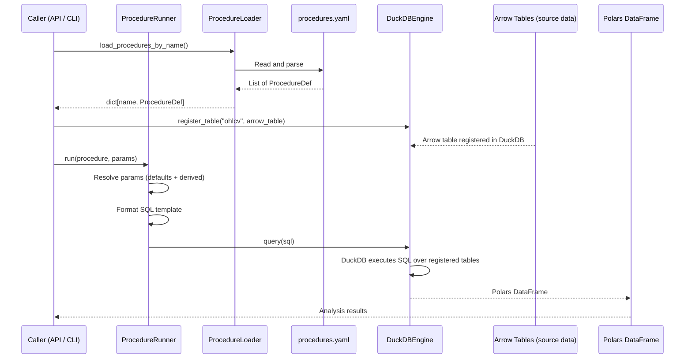
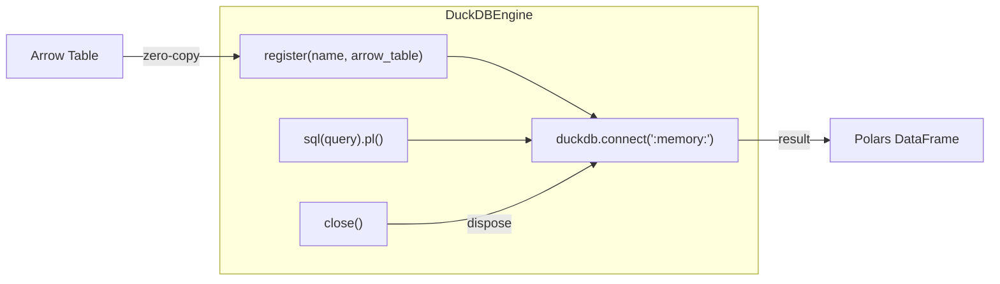

# Analytics Engine

## Overview

The analytics engine is a two-part system: **procedure definitions** (YAML config) describe what to compute, and **engines** (compute backends) execute the computation. This separation means new analytics can be added by editing a YAML file -- no Python code changes, no deployments.

The current implementation uses DuckDB as an ephemeral in-memory SQL engine that consumes Arrow tables and returns Polars DataFrames. The architecture is pluggable: additional engines (Polars-native, remote OLAP, etc.) can be registered without changing the procedure layer.

## Analytics Data Flow



## AnalyticsEngine Protocol

Defined in `merlin/app/analytics/engine.py`:

```python
class AnalyticsEngine(Protocol):
    def register_table(self, name: str, table: pa.Table) -> None: ...
    def query(self, sql: str) -> pl.DataFrame: ...
    def close(self) -> None: ...
```

Three operations, deliberately minimal:

- **`register_table`** -- bind an Arrow table to a name, making it queryable as a SQL table.
- **`query`** -- execute SQL, return a Polars DataFrame.
- **`close`** -- release resources.

**Decision: Arrow in, Polars out.**
Arrow is the ingestion interchange format -- engines receive data in the same format that sources produce it. Polars is the compute/analysis format -- richer API for downstream manipulation, grouping, joins. DuckDB bridges both natively with zero-copy.

## DuckDBEngine

The sole engine implementation. Key characteristics:

- **Ephemeral**: creates a fresh `:memory:` DuckDB connection on instantiation. No persistent state, no files on disk.
- **Context manager**: supports `with DuckDBEngine() as engine:` for automatic cleanup.
- **Zero-copy Arrow registration**: DuckDB's `register()` maps Arrow tables without copying data.
- **Polars output**: `conn.sql(query).pl()` returns a Polars DataFrame directly from DuckDB's result set.



**Decision: Ephemeral over persistent DuckDB.**
Every analytics run starts clean and computes from source data. This eliminates state management, cache invalidation, and stale data risks. The cost is re-registration of Arrow tables on each run, which is negligible because DuckDB's `register()` is zero-copy.

Rejected alternative: persistent DuckDB file with incremental updates. Adds complexity (schema migrations, consistency checks, storage management) with no measurable benefit at current data volumes.

## Procedure Definition Structure

```mermaid
graph TB
    subgraph "ProcedureDef (Pydantic model)"
        NAME["name: str"]
        DESC["description: str"]
        INPUT["input: dict[str, ParamDef]"]
        OUTPUT["output_schema: dict[str, str]"]
        ENG["engine: str"]
        SQL["sql: str (template)"]
    end

    subgraph "ParamDef"
        PTYPE["type: str"]
        PDEFAULT["default: Any"]
    end

    INPUT --> PTYPE
    INPUT --> PDEFAULT

    subgraph "Resolution at Runtime"
        PARAMS["User params"]
        DEFAULTS["ParamDef defaults"]
        DERIVED["Derived params (e.g., window_minus_1)"]
        RESOLVED["Resolved dict"]
    end

    PARAMS --> RESOLVED
    DEFAULTS --> RESOLVED
    DERIVED --> RESOLVED
    RESOLVED -->|str.format()| SQL
```

### ParamDef

Each input parameter has a `type` (for documentation/validation) and an optional `default`. If the caller omits a parameter and no default exists, the runner raises `ValueError`.

### Derived Parameters

The `_resolve_params` function generates derived values from resolved params. Currently:

- If `window` is present, `window_minus_1` is auto-generated (integer value of `window` minus 1).

This handles the common SQL pattern where a window of N requires `ROWS BETWEEN (N-1) PRECEDING AND CURRENT ROW`.

### SQL Templates

Templates use Python `str.format()` with `{param_name}` placeholders. The runner resolves all params (user-supplied, defaults, derived) and formats the SQL string before passing it to the engine.

**Decision: Template SQL over parameterized queries.**
DuckDB parameterized queries (`$1`, `$2`) cannot be used for:
- Window function frame sizes (`ROWS BETWEEN {window_minus_1} PRECEDING`)
- Table names (`FROM {table_name}`)
- Dynamic column references

Template formatting handles all of these. The trade-off is that parameter values are interpolated as strings, but since these procedures are internal (not user-facing SQL injection vectors), this is acceptable.

Rejected alternative: building SQL via an ORM or query builder. Adds a dependency and obscures the SQL, which is the primary domain logic. Data engineers want to read and edit SQL directly.

## Current Procedures

Defined in `config/procedures.yaml`:

### daily_returns

Calculates daily returns using `LAG()` window function over closing prices, partitioned by symbol.

```
Input: table_name (default: "ohlcv")
Output: symbol, market_date, close, daily_return
```

### moving_average

Configurable-window simple moving average over closing prices. Uses the `window_minus_1` derived parameter for the `ROWS BETWEEN` frame.

```
Input: table_name (default: "ohlcv"), window (default: 20)
Output: symbol, market_date, close, moving_avg
```

### symbol_summary

Aggregate statistics per symbol: trading days, date range, period high/low, first/last close, total return.

```
Input: table_name (default: "ohlcv")
Output: symbol, trading_days, first_date, last_date, period_low, period_high, first_close, last_close, total_return
```

### correlation_matrix

Cross-asset return correlation using a CTE to compute daily returns first, then `CORR()` aggregate over joined results.

```
Input: table_name (default: "ohlcv")
Output: symbol_a, symbol_b, correlation
```

## ProcedureRunner

`merlin/app/analytics/runner.py` -- the orchestrator that connects procedures to engines.

```python
class ProcedureRunner:
    def __init__(self, engines: dict[str, AnalyticsEngine]) -> None:
        self._engines = engines

    def run(self, procedure: ProcedureDef, params: dict[str, Any] | None = None) -> pl.DataFrame:
        engine = self._engines.get(procedure.engine)
        resolved = _resolve_params(procedure, params or {})
        sql = procedure.sql.format(**resolved)
        return engine.query(sql)
```

The runner:
1. Looks up the engine by the procedure's `engine` field (e.g., `"duckdb"`).
2. Resolves parameters: merges user-supplied values with defaults, generates derived params.
3. Formats the SQL template with resolved params.
4. Delegates execution to the engine and returns the result.

## Procedure Loader

`merlin/app/analytics/loader.py` provides two functions:

- `load_procedures(path)` -- parses the YAML file into a list of `ProcedureDef` models.
- `load_procedures_by_name(path)` -- returns a `dict[str, ProcedureDef]` for name-based lookup.

Both use Pydantic's `model_validate` for parsing, so invalid YAML produces clear validation errors.

## Decisions and Rejected Alternatives

| Decision | Reasoning | Rejected Alternative |
|---|---|---|
| YAML-driven procedure definitions | New analytics without code changes; non-engineers can contribute | Python functions -- requires deployment for every new analysis |
| Template SQL formatting | Handles dynamic table names, window sizes, column refs | Parameterized queries -- cannot parameterize identifiers or frame sizes |
| Engine as Protocol | Pluggable backends without inheritance | ABC -- adds forced coupling between unrelated engines |
| DuckDB for SQL engine | Zero-copy Arrow integration, full SQL:2003 window functions, fast | Polars-native -- less expressive for complex analytics SQL |
| Polars for output format | Rich downstream API, lazy evaluation support, Arrow-native | Pandas -- slower, more memory, weaker type system |
| Ephemeral engine instances | No state management, no cache invalidation | Persistent DuckDB -- complexity without benefit at current scale |
| Derived params in runner | Common patterns (window-1) without cluttering YAML | Require users to pass both window and window_minus_1 -- error-prone |

## File Reference

| File | Purpose |
|---|---|
| `merlin/app/analytics/engine.py` | `AnalyticsEngine` protocol, `DuckDBEngine` implementation |
| `merlin/app/analytics/models.py` | `ProcedureDef`, `ParamDef` Pydantic models |
| `merlin/app/analytics/runner.py` | `ProcedureRunner`, `_resolve_params` |
| `merlin/app/analytics/loader.py` | YAML loading: `load_procedures`, `load_procedures_by_name` |
| `config/procedures.yaml` | Procedure definitions (daily_returns, moving_average, symbol_summary, correlation_matrix) |
