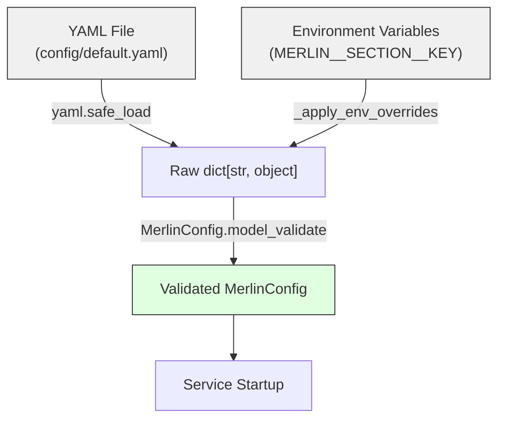
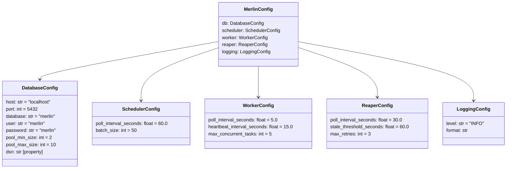

# Configuration System

## Philosophy

"Config/code first, UI optional." Everything in Merlin is definable via Pydantic models or YAML files. If a UI is built, it writes to the same definitions -- it is never a requirement. A developer with a text editor and a terminal can configure and operate the entire system.

## Config Load Flow



**Load order**: YAML --> environment variable overrides --> Pydantic validation.

Environment variables always win. This makes container-based deployment straightforward: bake defaults into the YAML, override per-environment via `docker-compose.yml` or Kubernetes env vars.

## Configuration Stack

### Layer 1: Pydantic Models

`merlin/core/config/models.py` defines the full configuration structure:

```
MerlinConfig
  |-- db: DatabaseConfig
  |-- scheduler: SchedulerConfig
  |-- worker: WorkerConfig
  |-- reaper: ReaperConfig
  |-- logging: LoggingConfig
```



**Field validators** on `DatabaseConfig`:
- `port`: `gt=0, le=65535` -- valid port range
- `pool_min_size`: `ge=1` -- at least one connection
- `pool_max_size`: `ge=1` -- at least one connection

The `dsn` property assembles the SQLAlchemy async connection string: `postgresql+asyncpg://{user}:{password}@{host}:{port}/{database}`.

### Layer 2: YAML Files

Three YAML files in `config/`:

| File | Purpose | Consumed By |
|---|---|---|
| `default.yaml` | Full default configuration for all services | `load_config()` via bootstrap |
| `assets.yaml` | Asset registry (symbol, name, asset_type, exchange) | `setup_market_schedules()` |
| `procedures.yaml` | Analytics procedure definitions | `load_procedures()` |

`default.yaml` mirrors the `MerlinConfig` structure exactly. Every field has a sensible default for local development.

`assets.yaml` currently defines 7 assets: 3 ETFs (SPY, QQQ, VTI), 1 bond ETF (BND), and 3 stocks (AAPL, MSFT, GOOGL).

### Layer 3: Environment Variable Overrides

Pattern: `MERLIN__SECTION__KEY` (double underscore separator).

```
MERLIN__DB__HOST=prod-db.example.com
MERLIN__DB__PORT=5433
MERLIN__WORKER__POLL_INTERVAL_SECONDS=10.0
MERLIN__LOGGING__LEVEL=DEBUG
```

The `_apply_env_overrides` function in `merlin/core/config/loader.py`:

1. Scans all environment variables for the `MERLIN__` prefix.
2. Splits the remaining key on `__` to get `[section, field]`.
3. Uses `match/case` to handle exactly two-part keys (section + field). Deeper nesting is ignored.
4. Writes the string value into the raw dict, which Pydantic then coerces to the correct type during validation.

**Decision: Two-level nesting only.**
The match statement handles exactly `[section, field]`. This is intentional: deeper nesting adds complexity without benefit. If a config section needs sub-objects, flatten them with descriptive field names (e.g., `pool_min_size` not `pool.min_size`).

## Config Loader

`merlin/core/config/loader.py` -- the `load_config()` function:

```python
def load_config(path: Path | None = None) -> MerlinConfig:
    raw: dict[str, object] = {}
    if path is not None and path.exists():
        with open(path) as f:
            loaded = yaml.safe_load(f)
        if isinstance(loaded, dict):
            raw = cast("dict[str, object]", loaded)
    _apply_env_overrides(raw)
    return MerlinConfig.model_validate(raw)
```

Handles three scenarios:
1. **YAML + env vars**: Normal production/development path.
2. **Env vars only** (no path or missing file): Builds config entirely from environment variables and Pydantic defaults.
3. **Neither**: Falls through to Pydantic defaults -- valid for testing.

## 12-Factor Compatibility

The configuration system follows [12-factor app](https://12factor.net/config) principles:

- **Config in the environment**: `MERLIN__` env vars override everything.
- **No code changes for deployment**: Same binary, different env vars.
- **Sensible defaults**: Local development works with zero configuration.

In practice, the Docker Compose setup uses exactly one override:

```yaml
environment:
  MERLIN__DB__HOST: timescaledb
```

This switches the database host from `localhost` (YAML default) to the Docker network hostname, with everything else unchanged.

## Decisions and Rejected Alternatives

| Decision | Reasoning | Rejected Alternative |
|---|---|---|
| Pydantic for config models | Runtime validation, type coercion, clear error messages | Raw dicts -- no validation, no type safety |
| YAML for file config | Human-readable, supports comments, standard in DevOps | TOML -- less familiar in the data engineering ecosystem |
| Double-underscore env separator | Avoids collision with single-underscore field names | Single underscore -- ambiguous (`DB_POOL_MIN_SIZE`: is that `db.pool_min_size` or `db_pool.min_size`?) |
| Env vars override YAML | 12-factor compatible; container-friendly | YAML overrides env -- breaks standard deployment patterns |
| Two-level nesting limit | Covers all current needs; simple to reason about | Arbitrary depth -- complex parsing for no current use case |
| Separate YAML files per concern | Assets and procedures evolve independently of service config | Single monolithic config -- harder to manage, unclear ownership |
| All defaults in Pydantic models | Single source of truth; YAML is optional | Defaults only in YAML -- config becomes a hard requirement |

## File Reference

| File | Purpose |
|---|---|
| `merlin/core/config/models.py` | `MerlinConfig` and all nested config models |
| `merlin/core/config/loader.py` | `load_config()`, `_apply_env_overrides()` |
| `config/default.yaml` | Default service configuration |
| `config/assets.yaml` | Asset registry |
| `config/procedures.yaml` | Analytics procedure definitions |
