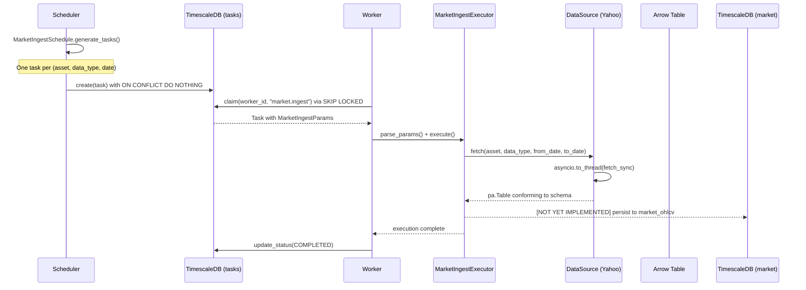
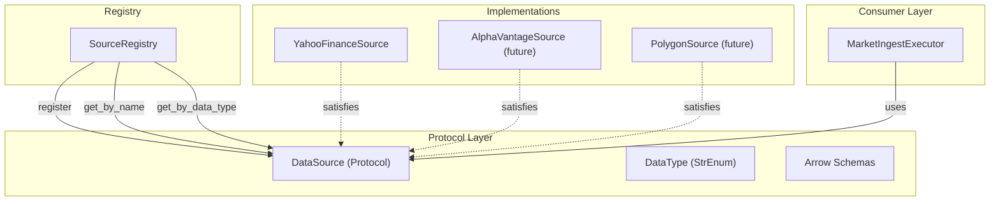

# Data Ingestion Pipeline

## Overview

The ingestion pipeline fetches market data from external providers, converts it into typed Apache Arrow tables, and (once persistence is implemented) stores it in TimescaleDB. The system is designed around a protocol-based plugin architecture so that adding a new data provider requires zero changes to the executor, scheduler, or any other component.

The pipeline operates through the task system: the scheduler creates ingestion tasks, workers claim and execute them, and the reaper handles failures. This document focuses on the data-specific layers that sit on top of that generic task infrastructure.

## Data Flow



## DataSource Protocol

All data providers implement the `DataSource` protocol, defined in `merlin/app/market/sources/interface.py`:

```python
class DataSource(Protocol):
    @property
    def name(self) -> str: ...

    @property
    def supported_data_types(self) -> frozenset[DataType]: ...

    async def fetch(
        self, asset: str, data_type: DataType, from_date: date, to_date: date,
    ) -> pa.Table: ...
```

Key aspects:

- **Protocol, not ABC** -- enables structural typing. Any class with the right shape satisfies the contract without explicit inheritance.
- **`frozenset` for supported types** -- immutable, hashable, communicates that the set of supported types is fixed at construction time.
- **Returns `pa.Table`** -- Arrow is the universal interchange format. Every downstream consumer (DuckDB analytics, persistence, API serialization) can work directly with Arrow without conversion overhead.

## DataType Enum

```python
class DataType(StrEnum):
    OHLCV = "ohlcv"
    DIVIDENDS = "dividends"
    SPLITS = "splits"
    FUNDAMENTALS = "fundamentals"
```

`StrEnum` so values serialize cleanly into JSON task params and YAML config. `FUNDAMENTALS` is defined but not yet implemented by any source.

## Arrow Schemas as Contracts

Centralized in `merlin/app/market/sources/schemas.py`. These schemas serve as the canonical contract between data sources and consumers.

| Schema | Fields |
|---|---|
| `OHLCV_SCHEMA` | symbol, market_date, open, high, low, close, volume, adjusted_close |
| `DIVIDENDS_SCHEMA` | symbol, market_date, amount |
| `SPLITS_SCHEMA` | symbol, market_date, ratio |

The `empty_table(schema)` helper creates a zero-row table that preserves the full schema. Sources return this when no data is found, ensuring downstream code never has to handle schema-less empty results.

**Decision: Arrow schemas over Pydantic models for data contracts.**
Arrow schemas define the physical column types at the serialization boundary. Pydantic models define application-layer semantics (task params, config). Using Arrow here avoids a round-trip through Python dicts and keeps the data path zero-copy compatible with DuckDB and Polars.

## Provider Plugin Architecture



### SourceRegistry

The `SourceRegistry` (`merlin/app/market/sources/registry.py`) is a simple name-keyed dictionary:

- `register(source)` -- adds a source by its `name` property.
- `get_by_name(name)` -- exact lookup, used when a task specifies which source to use.
- `get_by_data_type(data_type)` -- filters to sources supporting a given type. Enables future multi-source strategies (e.g., fallback chains, cheapest-first routing).

### Adding a New Provider

1. Create a class satisfying the `DataSource` protocol (no inheritance needed).
2. Implement `name`, `supported_data_types`, and `fetch()`.
3. Register it in the `SourceRegistry` (done in bootstrap code).

No changes required to `MarketIngestExecutor`, `MarketIngestSchedule`, `Worker`, or any other component. The task params already carry a `source` field identifying which provider to use.

## Yahoo Finance Adapter

`merlin/app/market/sources/yahoo.py` -- the only implemented source.

### Async wrapping

`yfinance` is fully synchronous. The `fetch()` method delegates to `asyncio.to_thread()` via `run_in_executor`:

```python
async def fetch(self, ...) -> pa.Table:
    loop = asyncio.get_running_loop()
    return await loop.run_in_executor(None, self.fetch_sync, ...)
```

This keeps the event loop unblocked while the HTTP calls execute in a thread pool.

### Lazy import

The `import yfinance` statement is inside `fetch_sync()`, not at module level. This is the only file in the project with a legitimate local import. Rationale: `yfinance` pulls in pandas, numpy, and several other heavy dependencies. Lazy importing avoids paying the ~500ms startup cost for services that never touch Yahoo data (e.g., the API server).

### Pattern matching dispatch

`fetch_sync` uses `match data_type` to dispatch to type-specific methods (`fetch_ohlcv`, `fetch_dividends`, `fetch_splits`). The catch-all `case _` raises `ValueError` for unsupported types.

### Empty data handling

Every fetch method checks for empty DataFrames and returns `empty_table(SCHEMA)` rather than propagating an empty pandas DataFrame. This ensures type safety: the return is always a valid `pa.Table` with the correct schema.

## Ingest Executor

`MarketIngestExecutor` (`merlin/app/market/tasks/ingest.py`) extends `ModelTaskExecutor[MarketIngestParams]`:

```python
class MarketIngestParams(BaseModel):
    asset: str
    source: str
    data_type: DataType
    from_date: date
    to_date: date
```

The executor receives pre-validated `MarketIngestParams` from the generic `ModelTaskExecutor` parsing layer. It calls `source.fetch()`, logs the row count, and returns. Persistence to `market_ohlcv` is the next planned feature.

**Decision: `_params_type = MarketIngestParams` as explicit ClassVar.**
Rejected alternative: introspecting the generic type parameter via `get_args()` or `__init_subclass__`. Explicit assignment is debuggable and pyright-friendly. One line of "boilerplate" is worth the clarity.

## Schedule

`MarketIngestSchedule` generates tasks on a daily cadence:

- Iterates all configured `(asset, data_type)` combinations.
- Uses a configurable `lookback_days` window (default 7) to set the date range.
- Task key format: `market:ingest:{symbol}:{data_type}:{from_date}` -- encodes the date for idempotent creation via `ON CONFLICT (key) DO NOTHING`.

Assets are loaded from `config/assets.yaml`. Data types are currently hardcoded to `[OHLCV, DIVIDENDS, SPLITS]` in the bootstrap function (`merlin/app/market/bootstrap.py`).

## Decisions and Rejected Alternatives

| Decision | Reasoning | Rejected Alternative |
|---|---|---|
| Protocol for DataSource | Structural typing; no forced inheritance tree | ABC with `@abstractmethod` -- adds coupling |
| Arrow as interchange format | Zero-copy into DuckDB/Polars; schema enforcement at construction | Pydantic models -- would require serialize/deserialize round-trips |
| Lazy yfinance import | Avoids 500ms startup penalty for non-ingestion services | Top-level import -- would slow all service starts |
| asyncio.to_thread for sync sources | Keeps event loop free; simple, no custom thread management | Running yfinance in a subprocess -- overkill, complex IPC |
| Date in task key | Makes tasks naturally idempotent per day; re-runs create new tasks | Separate dedup table -- unnecessary complexity |
| Empty table with schema on no data | Consumers never handle schemaless results | Return None -- forces null checks everywhere |
| One task per (asset, data_type) | Fine-grained retry and progress tracking | Batch all assets into one task -- one failure blocks everything |

## File Reference

| File | Purpose |
|---|---|
| `merlin/app/market/sources/interface.py` | `DataSource` protocol, `DataType` enum |
| `merlin/app/market/sources/schemas.py` | Arrow schema definitions, `empty_table()` helper |
| `merlin/app/market/sources/registry.py` | `SourceRegistry` -- plugin registration and lookup |
| `merlin/app/market/sources/yahoo.py` | `YahooFinanceSource` -- yfinance adapter |
| `merlin/app/market/tasks/ingest.py` | `MarketIngestExecutor`, `MarketIngestSchedule` |
| `merlin/app/market/bootstrap.py` | Wiring: `setup_market_worker()`, `setup_market_schedules()` |
| `merlin/app/market/models/asset.py` | `Asset` model, `AssetType` enum |
| `config/assets.yaml` | Asset registry (symbols, names, types, exchanges) |
