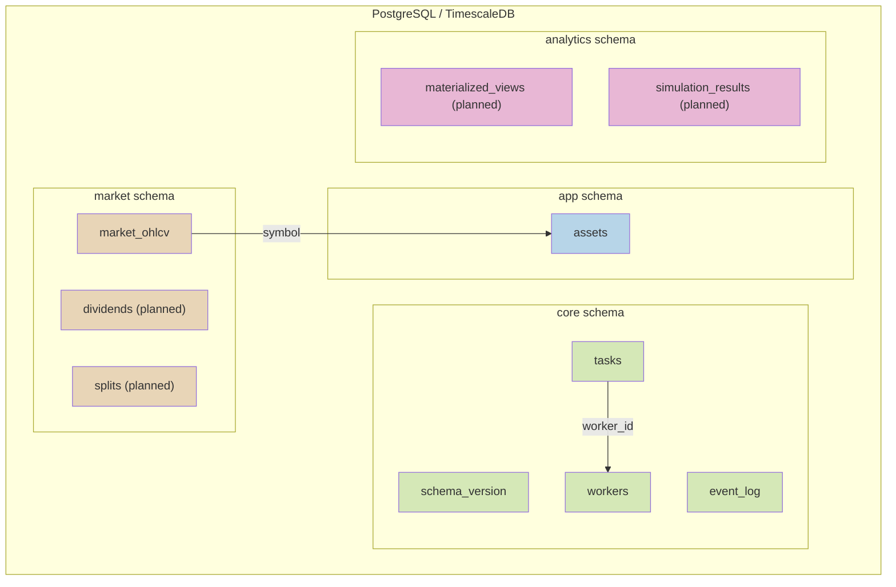
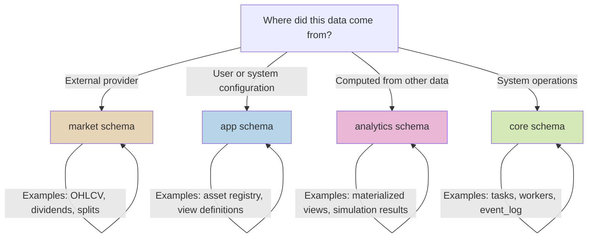
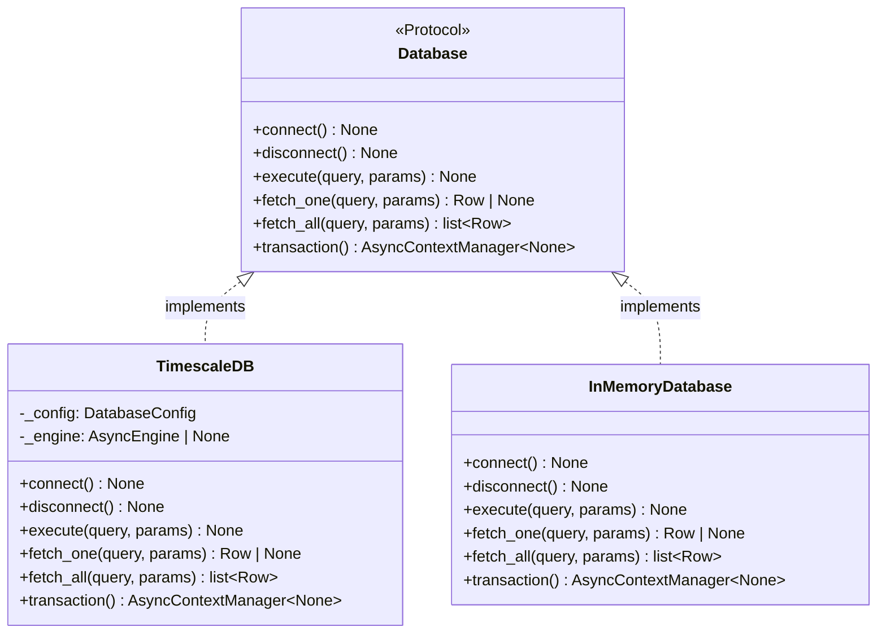
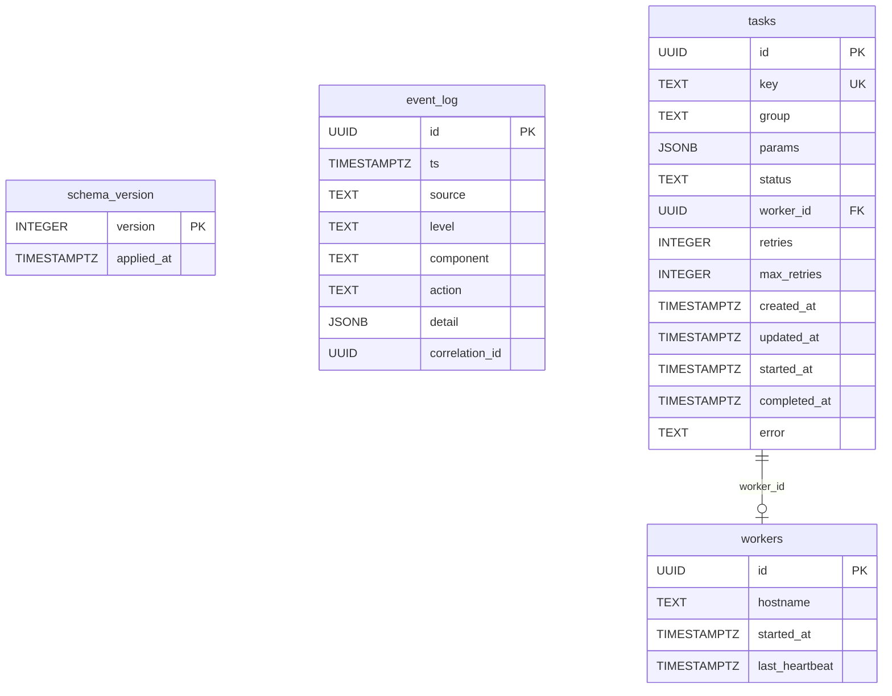
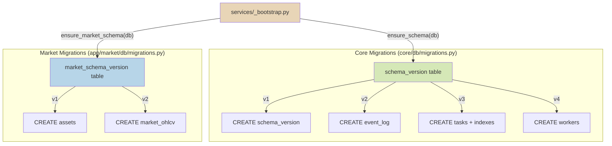
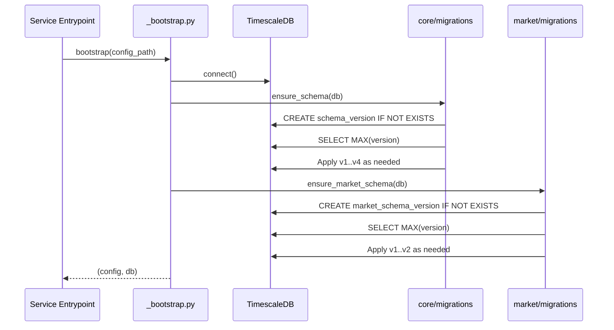

# Database Architecture

Merlin uses PostgreSQL (via TimescaleDB) as its sole persistent store. Four logical
schemas separate data by origin and purpose. The database abstraction layer uses
raw SQL with a Protocol-based interface, avoiding ORM overhead entirely.

## Schema Organization



| PG Schema | Purpose | What belongs here | Current tables |
|-----------|---------|-------------------|----------------|
| `core` | Infrastructure & orchestration | Operational state -- task scheduling, worker coordination, observability. Not domain-specific. | `schema_version`, `event_log`, `tasks`, `workers` |
| `app` | Definitions & metadata | Configuration describing what the system should do -- asset registries, view/simulation definitions. Source of truth for both code and UI config. | `assets` |
| `market` | Raw ingested data | Time-series from external providers, stored as-is. Append-heavy, immutable, keyed by (symbol, date). Never derived. | `market_ohlcv` |
| `analytics` | Derived & computed data | Output from analytics, simulations, materialized views. Reproducible from source data + definitions. | _(planned)_ |

### Decision Rule: Where Does This Data Belong?



## Database Abstraction Layer

### Protocol-Based Interface

The `Database` Protocol defines the contract that all implementations must satisfy:

```
Database (Protocol)
  connect()        -> None
  disconnect()     -> None
  execute(query, params)    -> None
  fetch_one(query, params)  -> Row | None
  fetch_all(query, params)  -> list[Row]
  transaction()    -> AsyncContextManager[None]
```

`Row` is defined as `dict[str, Any]` -- a clean type alias that avoids complex
generic type gymnastics while providing clear typing at the database boundary.



### Positional Parameters

All SQL uses positional parameters (`:0`, `:1`, `:2`, ...) rather than named
parameters. The `TimescaleDB` implementation converts these to a dict for
SQLAlchemy's `text()` binding:

```python
param_dict = {str(i): v for i, v in enumerate(params)}
await conn.execute(text(query), param_dict)
```

This keeps query strings clean and avoids parameter name collisions across
different query builders.

## Table Schemas

### Core Tables (managed by `core/db/migrations.py`)



Key indexes on `tasks`:

- `idx_tasks_claim`: `(group, status, created_at) WHERE status = 'pending'` --
  partial index powering the `SKIP LOCKED` claim query
- `idx_tasks_running`: `(status) WHERE status = 'running'` -- used by the reaper
  to find stale tasks
- `idx_tasks_worker`: `(worker_id) WHERE worker_id IS NOT NULL` -- join
  optimization for worker lookups

### Market Tables (managed by `app/market/db/migrations.py`)

```mermaid
erDiagram
    market_schema_version {
        INTEGER version PK
        TIMESTAMPTZ applied_at
    }

    assets {
        TEXT symbol PK
        TEXT name
        TEXT asset_type
        TEXT exchange
        BOOLEAN active
    }

    market_ohlcv {
        TEXT symbol PK_FK
        DATE market_date PK
        DOUBLE_PRECISION open
        DOUBLE_PRECISION high
        DOUBLE_PRECISION low
        DOUBLE_PRECISION close
        BIGINT volume
        DOUBLE_PRECISION adjusted_close
    }

    assets ||--o{ market_ohlcv : "symbol"
```

## Migration System

Each domain manages its own schema version independently. This avoids a single
migration sequence that would couple unrelated domains.



### Migration Algorithm

Both core and market migrations follow the same pattern:

1. Ensure the version-tracking table exists (`schema_version` or
   `market_schema_version`)
2. Read the current version from the version table
3. Apply each migration from `current + 1` to the target version
4. Insert a version record after each successful migration

Migrations are idempotent (`CREATE TABLE IF NOT EXISTS`, `CREATE INDEX IF NOT
EXISTS`) as a safety net, but the version tracking prevents re-execution.

### Bootstrap Execution Order



## Decision: Raw SQL Over ORM

Direct parameterized SQL via SQLAlchemy's async engine was chosen over
SQLAlchemy ORM, Tortoise ORM, or SQLModel. Reasons:

- **Full query control**: The `FOR UPDATE SKIP LOCKED` task-claiming query,
  partial indexes, and JSONB operations are awkward or impossible to express
  in most ORMs without dropping to raw SQL anyway.
- **Performance**: No model instantiation overhead, no identity map, no session
  tracking. Rows come back as plain dicts.
- **Simplicity**: The `Database` Protocol has 6 methods. An ORM adds sessions,
  unit-of-work patterns, lazy loading, relationship management, and migration
  tooling (Alembic) -- none of which this project needs.
- **Transparency**: Every SQL statement is visible in the code. No generated
  queries to debug.

SQLAlchemy is still used, but only as a connection pool and query execution
engine (`create_async_engine`, `text()`, `conn.execute()`).

## Decision: Protocol-Based Database Interface

The `Database` Protocol enables:

- **In-memory testing**: `InMemoryDatabase` and `InMemoryTaskRepository` allow
  full unit testing of workers, schedulers, and reapers without a running
  PostgreSQL instance.
- **Implementation swapping**: the `TimescaleDB` implementation could be
  replaced with a different PostgreSQL driver or even a different database
  engine without changing any consumer code.
- **Structural typing**: consumers depend on the Protocol, not a concrete class.
  No base class inheritance required for new implementations.

## Decision: Separate Migration Tracks

Each domain owns its migration history rather than sharing a single global
migration sequence. This was chosen because:

- **Domain independence**: adding market tables does not require modifying or
  coordinating with core migrations.
- **Future extensibility**: when `app/analytics/` or `app/portfolio/` domains are
  added, each will have its own migration track without version number conflicts.
- **Clear ownership**: if a market table needs a new column, the change is
  entirely within `app/market/db/migrations.py`.

Rejected alternative: Alembic with a single migration chain. This would couple
all domains into one linear history, requiring coordination for concurrent
development of different domains. The manual version-table approach is simpler
for the current scale and naturally supports per-domain isolation.

## Decision: Row Type as dict[str, Any]

`Row = dict[str, Any]` was chosen over typed dataclasses or TypedDicts at the
database boundary. Reasons:

- Database rows have dynamic shapes (especially with `SELECT *`)
- The conversion to domain models (Pydantic `BaseModel`) happens immediately
  after fetch in the repository layer (`_row_to_task`, `_row_to_event`)
- Adding typed row classes would double the model definitions without meaningful
  type safety, since the database is the actual source of truth for column types
