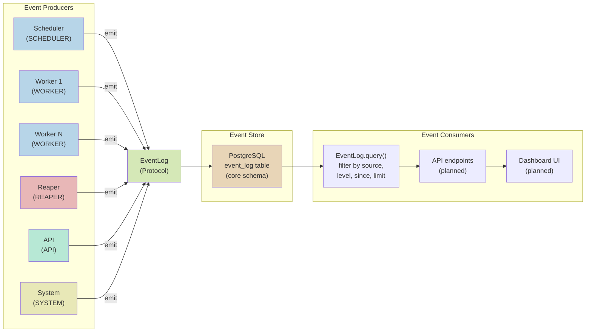
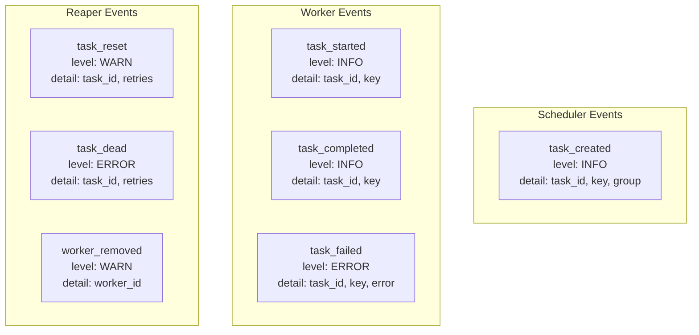
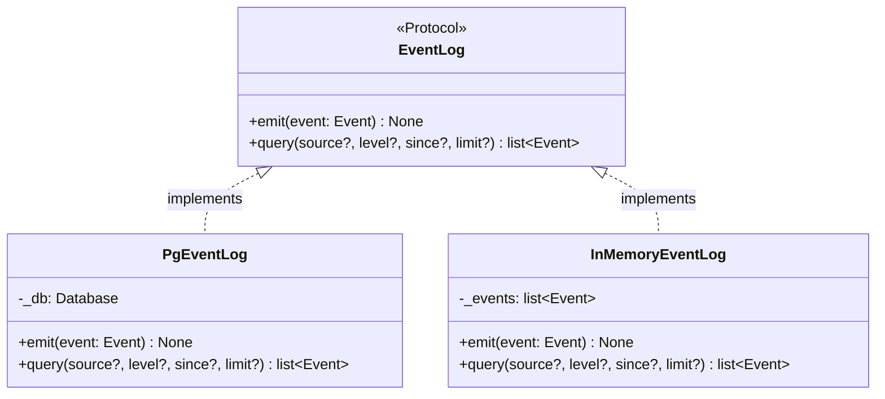
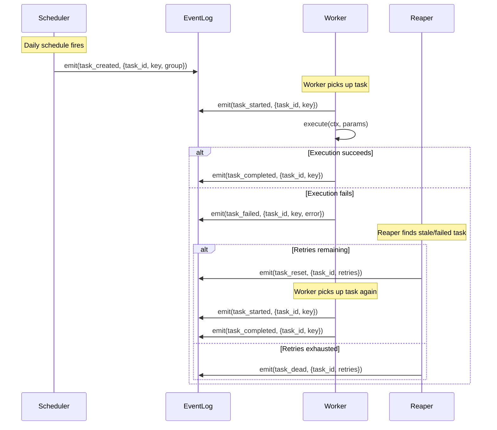

# Event System

Merlin uses a unified, append-only event log for observability across all system
components. Every significant action -- task creation, execution, failure,
recovery, worker lifecycle -- is recorded as a structured event in a single
PostgreSQL table.

## Event Model

```
Event
  id:        UUID              (auto-generated)
  timestamp: datetime          (auto-generated, UTC)
  source:    EventSource       (SCHEDULER | WORKER | REAPER | API | SYSTEM)
  level:     EventLevel        (DEBUG | INFO | WARN | ERROR)
  component: str               (free-text component identifier)
  action:    str               (what happened)
  detail:    dict[str, Any]    (arbitrary JSON payload)
```

The `source` enum identifies which system component emitted the event. The
`component` field is a free-text string allowing finer granularity within a
source (e.g., a specific worker name or scheduler instance). The `action` field
describes what happened. The `detail` field carries structured data specific to
the action.

## Event Flow



## Who Emits What



### Complete Event Catalog

| Source | Action | Level | Detail Fields | When |
|--------|--------|-------|---------------|------|
| `SCHEDULER` | `task_created` | `INFO` | `task_id`, `key`, `group` | Scheduler successfully creates a new task |
| `WORKER` | `task_started` | `INFO` | `task_id`, `key` | Worker claims and begins executing a task |
| `WORKER` | `task_completed` | `INFO` | `task_id`, `key` | Task execution finishes successfully |
| `WORKER` | `task_failed` | `ERROR` | `task_id`, `key`, `error` | Task execution raises an exception |
| `REAPER` | `task_reset` | `WARN` | `task_id`, `retries` | Stale task reset to PENDING for retry |
| `REAPER` | `task_dead` | `ERROR` | `task_id`, `retries` | Stale task marked DEAD (retries exhausted) |
| `REAPER` | `worker_removed` | `WARN` | `worker_id` | Dead worker removed from registry |

## EventLog Protocol



The interface is deliberately minimal:

- **`emit(event)`**: append an event to the log. Fire-and-forget semantics --
  the caller does not wait for confirmation or delivery guarantees beyond
  database insertion.
- **`query(source?, level?, since?, limit?)`**: retrieve events with optional
  filtering. Results are ordered by timestamp descending (newest first), capped
  by `limit` (default 100).

### Query Interface

The `PgEventLog.query()` method builds a dynamic SQL query based on which
filter parameters are provided:

```
SELECT * FROM event_log
  [WHERE source = :0]
  [AND level = :1]
  [AND ts >= :2]
ORDER BY ts DESC
LIMIT :N
```

Conditions are only added for non-None parameters, keeping the query efficient
when filtering by a single dimension.

## Storage

Events are stored in the `event_log` table in the `core` PostgreSQL schema:

```
event_log
  id:             UUID PRIMARY KEY
  ts:             TIMESTAMPTZ NOT NULL
  source:         TEXT NOT NULL
  level:          TEXT NOT NULL
  component:      TEXT NOT NULL
  action:         TEXT NOT NULL
  detail:         JSONB NOT NULL DEFAULT '{}'
  correlation_id: UUID (nullable, reserved)
```

The `detail` column uses PostgreSQL's JSONB type, enabling:
- Flexible per-action payloads without schema changes
- JSON path queries for ad-hoc investigation
- Indexing on specific JSON fields if query patterns emerge

## Event Lifecycle Through the Task System



## In-Memory Implementation for Testing

`InMemoryEventLog` stores events in a Python list and filters them in memory.
It implements the same `EventLog` Protocol, enabling full integration testing
of components that emit events without requiring a PostgreSQL instance.

This is the same structural typing pattern used throughout Merlin's core:
Protocol defines the contract, PostgreSQL provides the production implementation,
in-memory provides the test implementation.

## Decision: Unified Log vs Per-Component Logs

A design with separate event tables per component (`scheduler_events`,
`worker_events`, `reaper_events`) was considered. The unified log was chosen
because:

- **Single-pane observability**: one query shows the full timeline of a task's
  lifecycle across all components. With separate tables, reconstructing a task's
  journey requires joining multiple tables.
- **Simpler schema**: one table, one migration, one query interface.
- **Component identification**: the `source` enum field provides the same
  filtering capability that separate tables would, without the overhead.
- **Future dashboard**: a UI that shows system activity benefits from a single
  data source with consistent schema, rather than aggregating across tables.

## Decision: correlation_id Column Reserved but Unused

The `event_log` table has a `correlation_id UUID` column (nullable) that is
defined in the migration but not currently populated by any event producer. It
was initially designed to link related events (e.g., all events for the same
task execution cycle).

It was deprioritized because:

- **No current consumer**: nothing queries by `correlation_id` today.
- **task_id serves a similar purpose**: filtering events by `detail->>'task_id'`
  provides task-level correlation for the current use cases.
- **Complexity cost**: generating and propagating correlation IDs through async
  task boundaries (scheduler -> worker -> executor) adds plumbing that is not
  justified without a consumer.

The column remains in the schema so it can be activated when distributed tracing
or cross-task correlation becomes a concrete requirement.

## Decision: JSONB Detail Field vs Typed Columns

The `detail` column is JSONB rather than having typed columns for every possible
event payload (e.g., `task_id TEXT`, `error TEXT`, `retries INTEGER`). This was
chosen because:

- **Schema flexibility**: new event types can carry new data without migrations.
  Adding a `worker_removed` event with a `worker_id` field required zero schema
  changes.
- **Sparse data**: different events carry different fields. Typed columns would
  result in mostly-NULL columns across the table.
- **Query capability**: PostgreSQL JSONB supports indexing and path queries
  (`detail->>'task_id'`) for the cases where structured querying is needed.
- **Tradeoff acknowledged**: JSONB lacks compile-time type checking. The Event
  Pydantic model with `detail: dict[str, Any]` provides runtime structure, and
  the event catalog above documents the expected fields per action.
