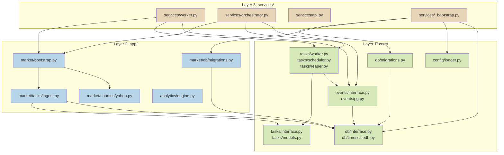
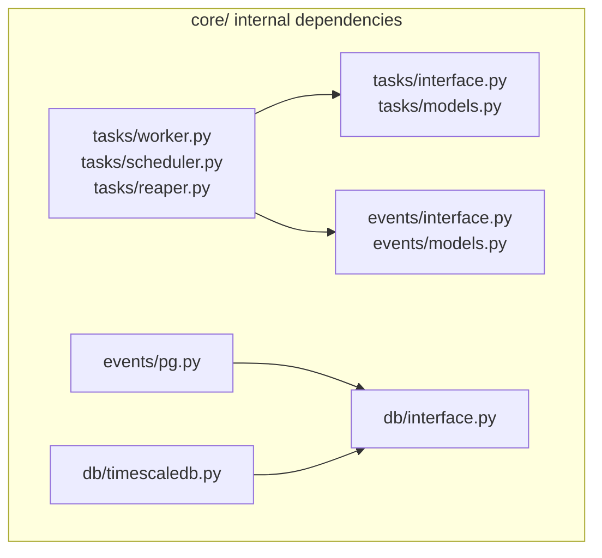
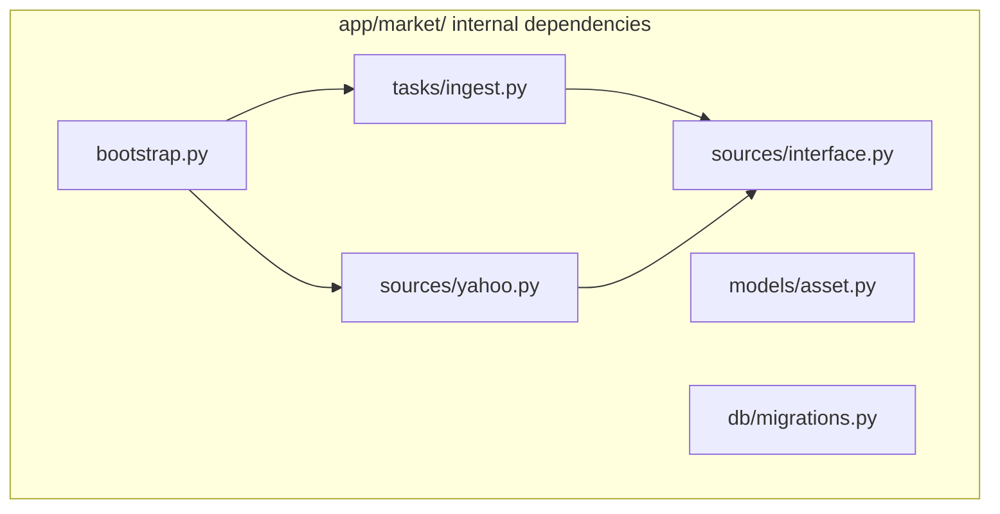
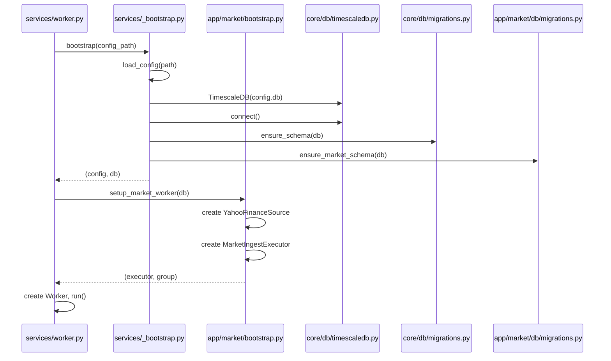

# Project Structure & Layering

Merlin uses a three-layer architecture that enforces strict dependency direction:
infrastructure flows upward into domain logic, which flows upward into process
entrypoints. No layer may import downward.

## Directory Layout

```
merlin/
├── core/                        # Layer 1: Infrastructure
│   ├── tasks/                   # Task queue system
│   │   ├── models.py            # Task, TaskStatus, TaskContext, WorkerInfo
│   │   ├── interface.py         # TaskRepository, TaskExecutor, TaskSchedule protocols
│   │   ├── pg_repository.py     # PostgreSQL implementation
│   │   ├── memory.py            # In-memory implementation (testing)
│   │   ├── worker.py            # Pull-based task worker
│   │   ├── scheduler.py         # Schedule-driven task creator
│   │   └── reaper.py            # Stale task recovery
│   ├── events/                  # Event logging
│   │   ├── models.py            # Event, EventSource, EventLevel
│   │   ├── interface.py         # EventLog protocol
│   │   ├── pg.py                # PostgreSQL implementation
│   │   └── memory.py            # In-memory implementation (testing)
│   ├── db/                      # Database abstraction
│   │   ├── interface.py         # Database protocol, Row type
│   │   ├── timescaledb.py       # SQLAlchemy async engine implementation
│   │   ├── memory.py            # In-memory implementation (testing)
│   │   └── migrations.py        # Core schema migrations (v1-v4)
│   └── config/                  # Configuration management
│       ├── loader.py            # YAML config loading
│       └── models.py            # Pydantic config models
├── app/                         # Layer 2: Domain Logic
│   ├── market/                  # Market data ingestion domain
│   │   ├── sources/             # Data providers
│   │   │   ├── interface.py     # DataSource protocol, DataType enum
│   │   │   ├── schemas.py       # Source-specific schemas
│   │   │   ├── yahoo.py         # Yahoo Finance implementation
│   │   │   └── registry.py      # Provider registry
│   │   ├── tasks/               # Domain task executors & schedules
│   │   │   └── ingest.py        # MarketIngestExecutor, MarketIngestSchedule
│   │   ├── db/                  # Domain-specific migrations
│   │   │   └── migrations.py    # Market schema (assets, market_ohlcv)
│   │   ├── models/              # Domain models
│   │   │   └── asset.py         # Asset model
│   │   └── bootstrap.py         # Domain dependency wiring
│   ├── analytics/               # DuckDB analytics engine
│   │   ├── engine.py            # Query execution engine
│   │   ├── loader.py            # Config-driven procedure loading
│   │   ├── models.py            # Analytics domain models
│   │   └── runner.py            # Analytics runner
│   └── api/                     # API layer (stub)
└── services/                    # Layer 3: Process Entrypoints
    ├── _bootstrap.py            # Shared bootstrap (config, DB, migrations)
    ├── worker.py                # Worker process (asyncio.run)
    ├── orchestrator.py          # Scheduler + Reaper process
    └── api.py                   # FastAPI entrypoint (stub)
```

## Layer Dependency Rules



## Dependency Direction Within Layers





## Bootstrap Wiring Pattern

Each domain provides its own `bootstrap.py` that wires up domain-specific
dependencies. The shared `services/_bootstrap.py` handles cross-cutting concerns:
config loading, database connection, and migration execution.



## Key Rules

1. **core/ has zero domain imports.** It knows nothing about markets, analytics,
   or any business concept. It provides generic tasks, events, database access,
   and configuration. This makes `core/` independently reusable across projects.

2. **app/ imports from core/ but never from services/.** Domain modules use
   core infrastructure (protocols, models) but are unaware of how they get
   assembled into running processes.

3. **services/ imports from both, wires everything together.** Process entrypoints
   compose domain logic with infrastructure, handle signal management, and manage
   the asyncio event loop lifecycle.

4. **Each app domain owns its own migrations.** `core/db/migrations.py` manages
   infrastructure tables (schema_version, event_log, tasks, workers).
   `app/market/db/migrations.py` manages domain tables (assets, market_ohlcv).
   Each tracks its own version independently.

5. **Protocol-first design.** Every major boundary (Database, TaskRepository,
   EventLog, DataSource, TaskExecutor) is defined as a Protocol or ABC in an
   `interface.py` file. Implementations live in separate files. This enables
   in-memory test doubles without mocking frameworks.

## Decision: Why Not a Flat Structure?

A flat `merlin/tasks.py`, `merlin/events.py`, `merlin/worker.py` layout was
considered and rejected. The three-layer approach provides:

- **Enforced dependency direction**: infrastructure cannot accidentally import
  domain logic. A flat structure makes this a convention rather than a structural
  guarantee.
- **Independent reusability**: `core/` can be extracted into a shared library
  if a second project needs the same task/event infrastructure.
- **Domain isolation**: adding a new domain (e.g., `app/portfolio/`) follows the
  same pattern as `app/market/` without touching core or other domains.
- **Clear ownership**: when a bug is in task claiming, you look in `core/tasks/`.
  When it is in market data parsing, you look in `app/market/sources/`.

## Decision: Single Package vs Monorepo

A monorepo with separate packages (`merlin-core`, `merlin-market`,
`merlin-services`) was considered. Rejected because:

- The project is small enough that a single package with directory conventions
  provides the same isolation without the overhead of multiple `pyproject.toml`
  files, cross-package versioning, and workspace tooling.
- Python's import system makes package boundaries weaker than in languages with
  module systems (Go, Rust). Directory-level discipline is sufficient at this
  scale.
- If the project grows to warrant it, the layering makes extraction into separate
  packages straightforward since the dependency direction is already enforced.
