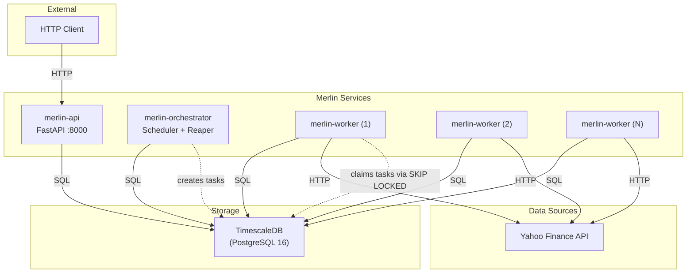
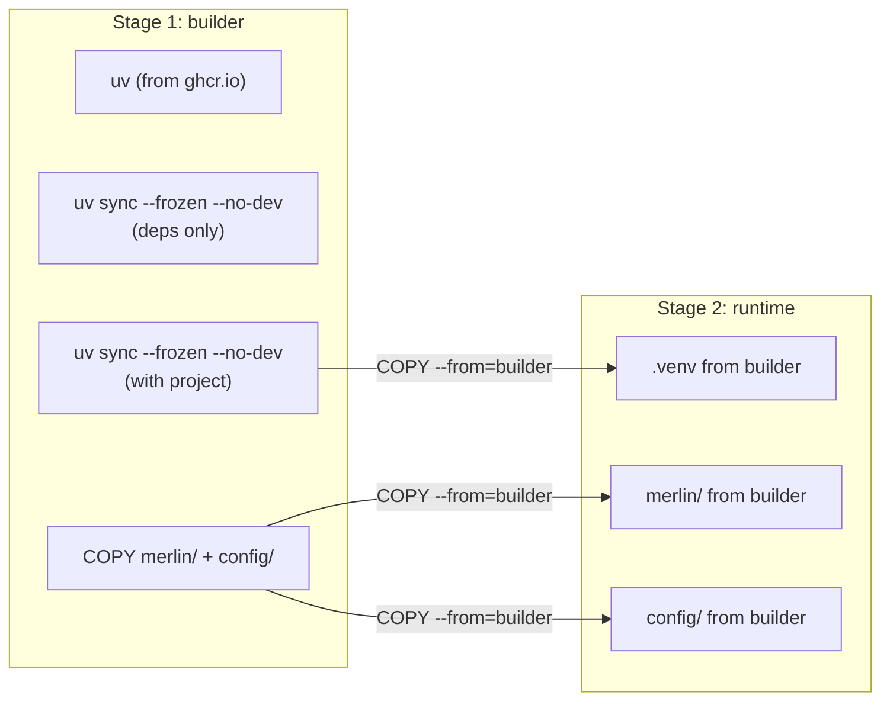
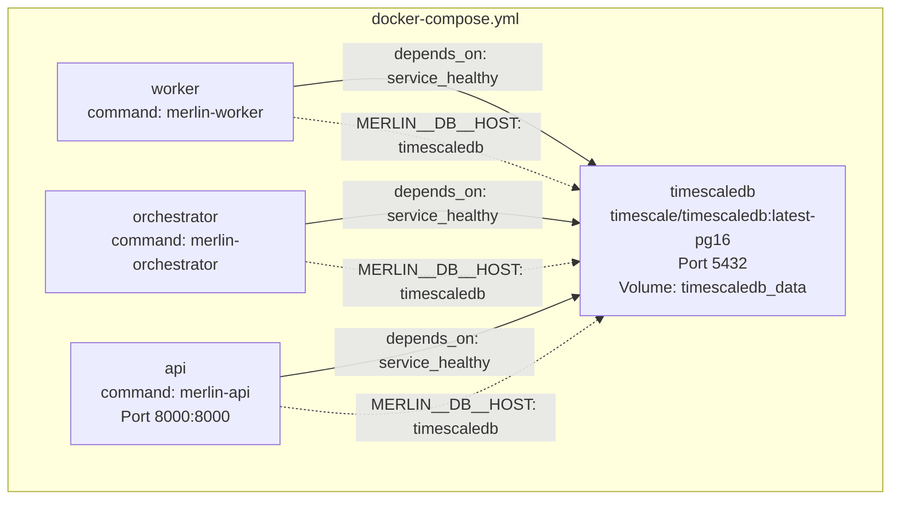
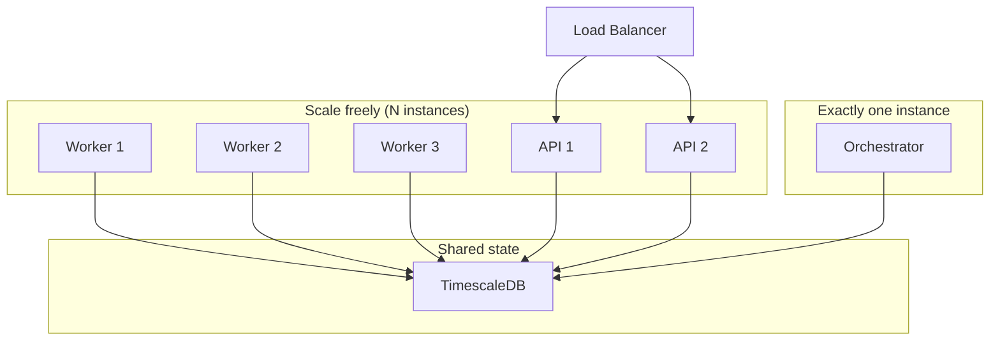

# Services and Deployment

## Overview

Merlin runs as three services -- worker, orchestrator, and API -- all sharing the same codebase and Docker image. A shared bootstrap function handles configuration loading, database connection, and schema migrations. Services are designed for container-based deployment with horizontal scaling where appropriate.

## Service Topology



## Three Services

### Worker (`merlin-worker`)

**Purpose**: Claims and executes tasks from the task queue.

**Characteristics**:
- Stateless -- all state lives in TimescaleDB.
- Horizontally scalable -- multiple workers compete for tasks via `SELECT ... FOR UPDATE SKIP LOCKED`.
- Single executor per worker -- currently `MarketIngestExecutor` for the `market.ingest` task group.
- Heartbeat loop -- runs concurrently with the task loop via `asyncio.create_task()`. Self-terminates after consecutive heartbeat failures.

**Startup flow**:
1. Bootstrap (config, DB, migrations).
2. Wire up market executor via `setup_market_worker(db)`.
3. Create `PgTaskRepository` and `PgEventLog`.
4. Initialize `Worker` with config-driven intervals.
5. Register signal handlers (SIGINT, SIGTERM) for graceful shutdown.
6. Enter poll loop.

### Orchestrator (`merlin-orchestrator`)

**Purpose**: Runs the Scheduler and Reaper concurrently as a single process.

**Characteristics**:
- Single instance -- the scheduler must be singular to avoid duplicate task creation.
- Runs two concurrent loops via `asyncio.gather(scheduler.run(), reaper.run())`.
- Scheduler generates tasks from registered schedules (currently `MarketIngestSchedule`).
- Reaper detects stale tasks (running tasks whose workers have stopped heartbeating) and either resets them to `PENDING` or marks them `DEAD` after max retries.

**Startup flow**:
1. Bootstrap (config, DB, migrations).
2. Load market schedules from `config/assets.yaml`.
3. Create Scheduler and Reaper with config-driven intervals.
4. Register signal handlers -- both scheduler and reaper stop on SIGINT/SIGTERM.
5. Enter concurrent loop.

### API (`merlin-api`)

**Purpose**: HTTP interface to the system.

**Characteristics**:
- FastAPI application served by uvicorn on port 8000.
- Currently exposes only a `/health` endpoint returning `{"status": "ok"}`.
- Horizontally scalable behind a load balancer.

## Shared Bootstrap

`merlin/services/_bootstrap.py` provides a common initialization sequence used by both worker and orchestrator:

```python
async def bootstrap(config_path: Path) -> tuple[MerlinConfig, TimescaleDB]:
    config = load_config(config_path)
    logging.basicConfig(level=config.logging.level, format=config.logging.format)
    db = TimescaleDB(config.db)
    await db.connect()
    await ensure_schema(db)        # Core tables: tasks, workers, event_log
    await ensure_market_schema(db)  # Domain tables: assets, market_ohlcv
    return config, db
```

Every service gets the same initialization: config loading, logging setup, database connection, and schema migrations. This ensures the database is always up to date regardless of which service starts first.

**Decision: Migrations in bootstrap, not a separate tool.**
At the current scale, running migrations on every service start is safe (all `CREATE TABLE IF NOT EXISTS` with version tracking). This avoids the operational overhead of a separate migration step. If destructive migrations become necessary, this will be extracted into a dedicated migration command.

## Signal Handling

Both worker and orchestrator register SIGINT and SIGTERM handlers:

```mermaid
sequenceDiagram
    participant OS as Operating System
    participant SVC as Service (Worker/Orchestrator)
    participant LOOP as Event Loop
    participant DB as TimescaleDB

    OS->>SVC: SIGTERM
    SVC->>LOOP: Set _running = False
    LOOP->>LOOP: Current poll cycle completes
    LOOP->>DB: Worker: remove_worker()
    LOOP->>DB: Disconnect
    SVC->>OS: Exit 0
```

The worker additionally cancels the heartbeat task and deregisters itself from the workers table. The orchestrator stops both scheduler and reaper via a lambda: `lambda: (scheduler.stop(), reaper.stop())`.

## Docker Setup

### Multi-Stage Dockerfile



Key details:
- **Base image**: `python:3.14-slim` for both stages.
- **uv for dependency management**: Copied from `ghcr.io/astral-sh/uv:latest`.
- **Two-phase sync**: First `uv sync` installs dependencies only (layer cached). Second `uv sync` installs the project after copying source code. This maximizes Docker layer caching -- dependency changes are rarer than code changes.
- **Runtime image**: Only `.venv`, source code, and config are copied. No build tools, no uv, no dev dependencies.

### Docker Compose Architecture



**TimescaleDB service**:
- Image: `timescale/timescaledb:latest-pg16` (PostgreSQL 16 with TimescaleDB extensions).
- Health check: `pg_isready -U merlin` with 5s interval, 5 retries.
- Persistent volume: `timescaledb_data` for data durability across restarts.

**Application services**:
- All three build from the same Dockerfile.
- Differentiated only by the `command` field (`merlin-worker`, `merlin-orchestrator`, `merlin-api`).
- All wait for `timescaledb: service_healthy` before starting.
- Single environment override: `MERLIN__DB__HOST: timescaledb` -- switches from the YAML default (`localhost`) to the Docker network hostname.

## Scaling Model



| Service | Scaling | Reason |
|---|---|---|
| Worker | Horizontal (any N) | Workers compete for tasks via `FOR UPDATE SKIP LOCKED`. No coordination needed. More workers = higher throughput. |
| Orchestrator | Exactly 1 | The scheduler creates tasks. Multiple schedulers would create duplicates (mitigated by `ON CONFLICT DO NOTHING` but wasteful). The reaper similarly should be singular to avoid double-processing stale tasks. |
| API | Horizontal (any N) | Stateless HTTP handlers behind a load balancer. |

**Task claim mechanism**: The critical scaling primitive is PostgreSQL's `SKIP LOCKED`:

```sql
UPDATE tasks SET status = 'running', worker_id = $1
WHERE id = (
    SELECT id FROM tasks
    WHERE "group" = $2 AND status = 'pending'
    ORDER BY created_at
    LIMIT 1
    FOR UPDATE SKIP LOCKED
)
RETURNING *
```

This provides lock-free task distribution: each worker atomically claims the next available task. If another worker already locked a row, `SKIP LOCKED` moves to the next one. No external queue, no coordination service, no leader election.

**Decision: PostgreSQL as the task queue.**
Using the existing database as a task queue avoids adding another infrastructure component (Redis, RabbitMQ, etc.). `SKIP LOCKED` provides the exact semantics needed for competing consumers. At the current scale (hundreds of tasks per day), this is well within PostgreSQL's capabilities.

Rejected alternative: Redis/RabbitMQ as external queue. Adds operational complexity (another service to monitor, secure, and back up) and splits state across systems. If task throughput reaches thousands per second, this decision should be revisited.

## Entrypoints

Defined in `pyproject.toml` under `[project.scripts]`:

| Command | Module | Function |
|---|---|---|
| `merlin-worker` | `merlin.services.worker` | `main()` |
| `merlin-orchestrator` | `merlin.services.orchestrator` | `main()` |
| `merlin-api` | `merlin.services.api` | `main()` |

Each `main()` function calls `asyncio.run()` on an async `run()` function (worker, orchestrator) or starts uvicorn directly (API).

## Decisions and Rejected Alternatives

| Decision | Reasoning | Rejected Alternative |
|---|---|---|
| Three separate services from one image | Same codebase, different entrypoints. Simple to build and deploy. | Monolith -- no independent scaling. Separate repos -- code duplication. |
| Shared bootstrap function | DRY initialization; ensures consistent DB state. | Per-service init -- drift risk, duplication. |
| Migrations on startup | Safe at current scale (all idempotent). Zero-ops for development. | Separate migration command -- operational overhead, easy to forget. |
| PostgreSQL SKIP LOCKED for task queue | No extra infrastructure; exact competing-consumer semantics. | Redis/RabbitMQ -- adds ops burden, splits state. |
| Single orchestrator instance | Prevents duplicate task creation and double-reaping. | Multiple orchestrators with distributed locks -- complexity not justified. |
| asyncio.gather for orchestrator loops | Simple concurrent execution; both loops are cooperative. | Separate processes -- harder to coordinate shutdown. |
| Multi-stage Docker build | Small runtime image; cached dependency layer. | Single-stage -- includes build tools in production image. |
| Health check via pg_isready | Standard PostgreSQL readiness check; works with Docker depends_on. | TCP port check -- doesn't verify PostgreSQL is actually ready. |

## File Reference

| File | Purpose |
|---|---|
| `merlin/services/_bootstrap.py` | Shared bootstrap: config, DB, migrations |
| `merlin/services/worker.py` | Worker service entrypoint |
| `merlin/services/orchestrator.py` | Orchestrator service entrypoint (scheduler + reaper) |
| `merlin/services/api.py` | FastAPI application and uvicorn entrypoint |
| `Dockerfile` | Multi-stage build (builder + runtime) |
| `docker-compose.yml` | Service definitions: timescaledb, worker, orchestrator, api |
| `pyproject.toml` | `[project.scripts]` entrypoint definitions |
| `merlin/core/tasks/worker.py` | Worker implementation (poll loop, heartbeat, task execution) |
| `merlin/core/tasks/scheduler.py` | Scheduler implementation (task generation loop) |
| `merlin/core/tasks/reaper.py` | Reaper implementation (stale task detection, retry/kill) |
| `merlin/core/tasks/pg_repository.py` | PostgreSQL task repository (SKIP LOCKED claims) |
