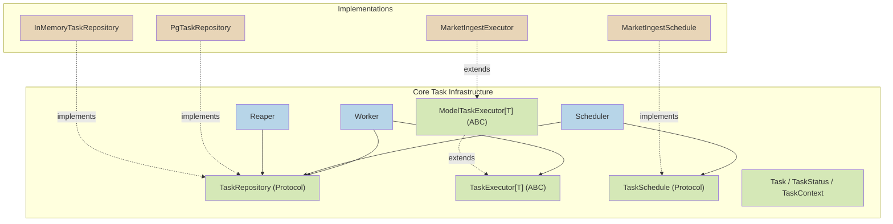
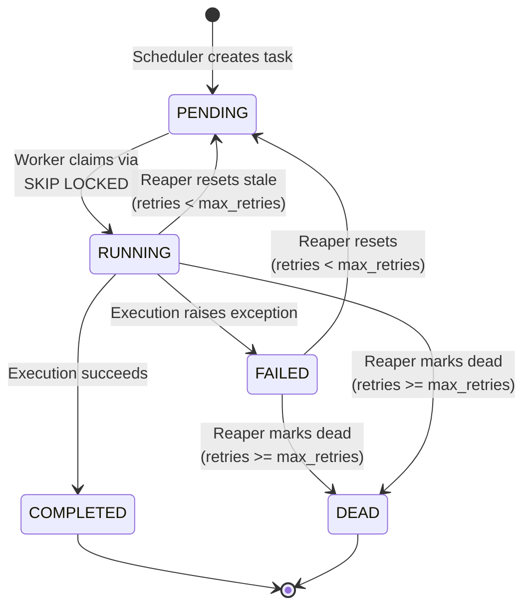
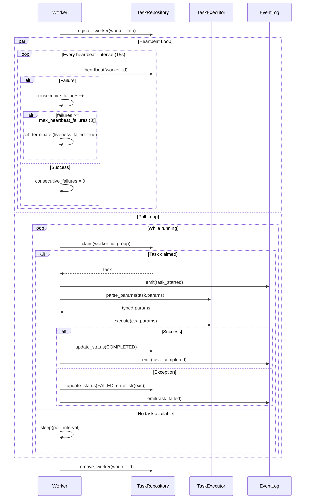
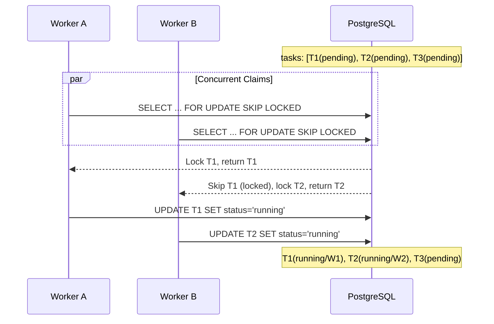
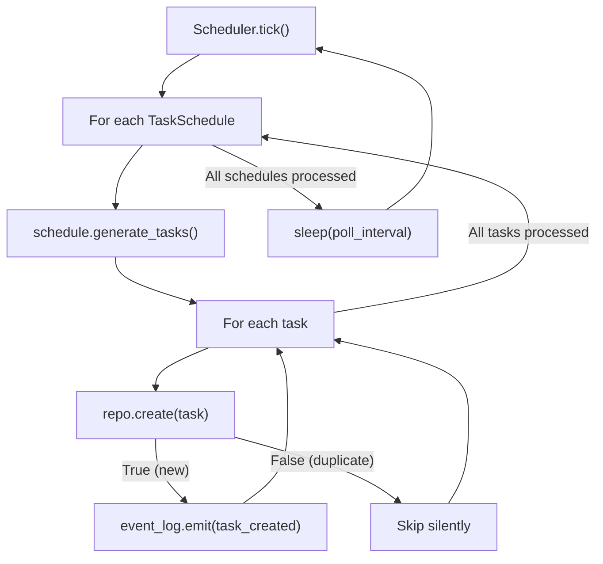
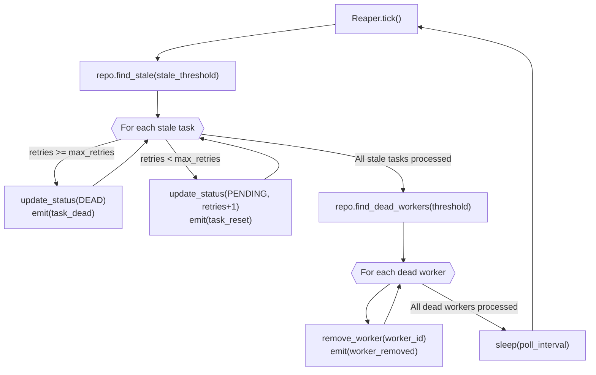
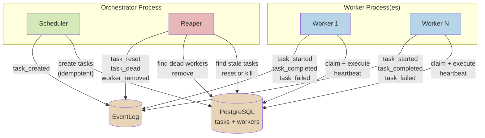

# Task System

The task system is the execution backbone of Merlin. It provides persistent,
retryable, distributed task processing using PostgreSQL as both the queue and
the state store. No external message broker is required.

## Component Overview



## Core Protocols and Abstractions

### TaskRepository (Protocol)

The persistence interface for task and worker state:

```
TaskRepository
  create(task) -> bool              # Returns False on duplicate key
  claim(worker_id, group) -> Task?  # Atomic claim via SKIP LOCKED
  update_status(task_id, status, *, error, retries) -> None
  get(task_id) -> Task?
  find_by_status(status) -> list[Task]
  find_stale(threshold_seconds) -> list[Task]
  register_worker(worker) -> None
  heartbeat(worker_id) -> None
  find_dead_workers(threshold_seconds) -> list[WorkerInfo]
  remove_worker(worker_id) -> None
```

Two implementations exist:
- **PgTaskRepository**: production implementation using PostgreSQL with
  `FOR UPDATE SKIP LOCKED` for lock-free concurrent claiming
- **InMemoryTaskRepository**: testing implementation with identical semantics

### TaskExecutor[T] (ABC)

The base class for all task executors, parameterized by a typed params type `T`:

```
TaskExecutor[T]
  parse_params(raw: dict) -> T       # Convert raw JSON to typed params
  execute(ctx: TaskContext, params: T) -> None  # Perform the work
```

### ModelTaskExecutor[T: BaseModel] (ABC)

A convenience base for executors whose params are Pydantic models. Subclasses
declare `_params_type` as a `ClassVar` and get automatic parsing:

```python
class MarketIngestExecutor(ModelTaskExecutor[MarketIngestParams]):
    _params_type = MarketIngestParams

    async def execute(self, ctx: TaskContext, params: MarketIngestParams) -> None:
        ...
```

The `parse_params` implementation calls `_params_type.model_validate(raw)`,
providing validation and type coercion for free.

### TaskSchedule (Protocol)

Schedules generate tasks on a recurring basis:

```
TaskSchedule
  schedule -> str                    # Cron expression (e.g. "@daily")
  generate_tasks() -> list[Task]     # Create task instances
```

Task creation is idempotent: each task has a unique `key` (e.g.,
`market:ingest:AAPL:ohlcv:2026-04-02`), and `TaskRepository.create()` returns
`False` if a task with that key already exists.

## Task Lifecycle



### Status Definitions

| Status | Meaning | Terminal? |
|--------|---------|-----------|
| `PENDING` | Waiting to be claimed by a worker | No |
| `RUNNING` | Claimed by a worker, execution in progress | No |
| `COMPLETED` | Execution finished successfully | Yes |
| `FAILED` | Execution raised an exception | No (reaper may retry) |
| `DEAD` | Exhausted all retry attempts | Yes |

## Worker Architecture

The Worker is a pull-based task processor. It registers itself, maintains a
heartbeat, and polls for available tasks in its assigned group.



### Worker Configuration

| Parameter | Default | Purpose |
|-----------|---------|---------|
| `poll_interval` | 5.0s | Time between task claim attempts when idle |
| `heartbeat_interval` | 15.0s | Time between heartbeat updates |
| `max_heartbeat_failures` | 3 | Consecutive failures before self-termination |

### Heartbeat and Liveness

The worker runs a concurrent heartbeat loop (`asyncio.create_task`) alongside
the main poll loop. If the heartbeat fails consecutively (e.g., database is
unreachable), the worker self-terminates by setting `_running = False` and
`_liveness_failed = True`. This prevents a zombie worker from holding tasks
it can no longer process.

On shutdown (normal or forced), the worker calls `remove_worker()` to
deregister itself from the workers table.

## Task Claiming Algorithm

The claim query is the most critical piece of the system:

```sql
UPDATE tasks SET status = 'running', worker_id = :0, started_at = :1, updated_at = :2
WHERE id = (
    SELECT id FROM tasks
    WHERE "group" = :3 AND status = 'pending'
    ORDER BY created_at
    LIMIT 1
    FOR UPDATE SKIP LOCKED
)
RETURNING *
```

Key properties:

- **`FOR UPDATE SKIP LOCKED`**: if another worker is already locking a row, skip
  it instead of waiting. This eliminates contention between concurrent workers.
- **`ORDER BY created_at`**: FIFO ordering ensures fairness.
- **`LIMIT 1`**: each worker claims exactly one task per cycle.
- **Single atomic statement**: the `SELECT` and `UPDATE` happen in one query,
  preventing race conditions.
- **Partial index**: `idx_tasks_claim ON tasks (group, status, created_at) WHERE
  status = 'pending'` ensures this query only scans pending tasks.



## Scheduler

The Scheduler runs on a configurable interval and generates tasks from all
registered schedules. Task creation is idempotent: duplicate keys are silently
ignored via `ON CONFLICT (key) DO NOTHING`.



### Idempotency Example

The `MarketIngestSchedule` generates task keys like
`market:ingest:AAPL:ohlcv:2026-04-02`. If the scheduler runs twice on the same
day, the second run finds existing keys and `create()` returns `False` for all
of them. No duplicate work is created.

## Reaper

The Reaper detects stale tasks (running tasks whose assigned worker has stopped
heartbeating) and either retries them or marks them as permanently dead.



### Stale Detection

A task is considered stale when:
1. Its status is `RUNNING`, AND
2. Either its assigned worker does not exist in the workers table, OR the
   worker's `last_heartbeat` is older than `stale_threshold` seconds

This is implemented as a single SQL query joining `tasks` to `workers`.

### Reaper Configuration

| Parameter | Default | Purpose |
|-----------|---------|---------|
| `stale_threshold` | 60.0s | How long since last heartbeat before a task is stale |
| `max_retries` | 3 | Maximum retry attempts before marking DEAD |
| `poll_interval` | 30.0s | Time between reaper sweeps |

## Scheduler-Worker-Reaper Interaction



The orchestrator process runs the Scheduler and Reaper concurrently via
`asyncio.gather()`. Worker processes run independently and can be scaled
horizontally -- each worker claims tasks from the shared PostgreSQL queue
without any coordinator.

## Rejected Alternatives

### `__init_subclass__` Magic for Type Extraction

An earlier design attempted to automatically extract the params type `T` from
`TaskExecutor[T]` using `__init_subclass__`, `__orig_bases__`, and
`typing.get_args()`. This was rejected because:

- **Too magical**: developers had to understand Python's generic type internals
  to debug issues.
- **Fragile**: multiple inheritance or intermediate base classes broke the
  introspection chain.
- **Opaque errors**: when type extraction failed, the error message was
  unhelpful (e.g., `IndexError` on empty `get_args` result).

Replaced with the explicit `_params_type: ClassVar` approach in
`ModelTaskExecutor`. One extra line per executor subclass, but completely
transparent and debuggable.

### Push-Based Task Assignment

A coordinator that assigns tasks to specific workers (push model) was
considered. Rejected because:

- **Single point of failure**: the coordinator becomes a bottleneck and
  availability risk.
- **Complexity**: requires tracking worker capacity, health, and load balancing
  logic in the coordinator.
- **Horizontal scaling**: adding workers requires no coordinator changes with
  pull-based design. Each worker just polls the same queue.

The pull-based model where workers compete for tasks via `SKIP LOCKED` is
simpler, fault-tolerant, and scales horizontally by adding worker processes.

### Redis-Based Queue (Celery, RQ, etc.)

Using Redis (or a dedicated message broker) for task queuing was considered.
Rejected because:

- **Extra dependency**: TimescaleDB/PostgreSQL is already the primary data store.
  Using it for tasks avoids operating a second stateful service.
- **Unified state**: all system state (tasks, workers, events, market data)
  lives in one database, simplifying backup, recovery, and debugging.
- **PostgreSQL is sufficient**: `FOR UPDATE SKIP LOCKED` provides the concurrent
  claiming semantics that Redis `BRPOPLPUSH` would provide, without the
  complexity of Redis persistence, replication, or Sentinel.
- **Transactional guarantees**: task state changes participate in PostgreSQL
  transactions, ensuring consistency with other data operations.

The tradeoff is that PostgreSQL-based queuing has higher latency than Redis
(milliseconds vs microseconds). This is acceptable for Merlin's workload, which
consists of market data ingestion tasks that run on daily or hourly schedules.

### Separate Task Tables Per Domain

Having `market_tasks`, `analytics_tasks`, etc. instead of a single generic
`tasks` table was considered. Rejected because:

- The task model is domain-agnostic: `id`, `key`, `group`, `params` (JSONB),
  `status`, `retries`. Domain-specific data lives in `params`.
- A single table enables a single Worker implementation, single Reaper, and
  unified observability.
- The `group` column provides domain-level filtering without table proliferation.
